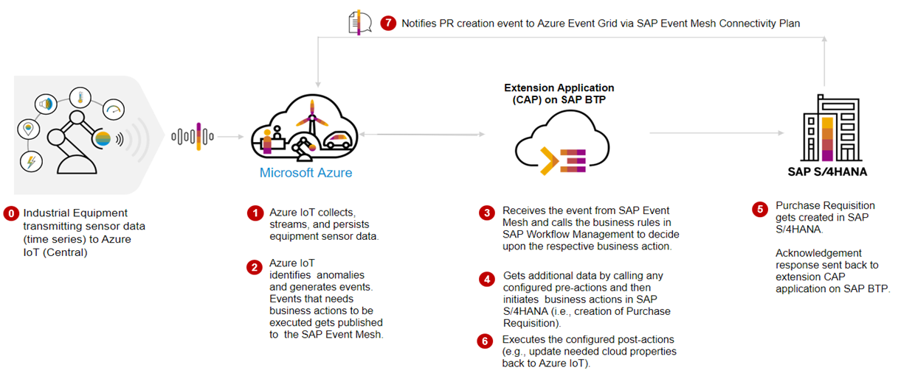

   

# IN263 - Support Industry 4.0 with Event-Driven Architecture  

## Description

This repository contains the material for the SAP TechEd 2023 session called **IN263 - Support Industry 4.0 with Event-Driven Architecture**.

## Overview

This session introduces attendees to a event-driven Industry 4.0 business scenario where they will implement Events-to-Business-Actions framework built on SAP BTP to integrate real time events generated from devices connected Microsoft Azure IoT Central into SAP Business Processes to enrich the outcome of enterprise operations and facilitate rapid decision making. This Events-to-Business-Actions framework has multiple extension application which can be used in combination with any hyperscaler or telco IoT.

## Business Process Flow

In this event-driven scenario, based on the real-time status of the IoT Devices , actionable events are sent to Events-to-Business-Actions framework built on SAP BTP via SAP Integration Suite Advanced Event Mesh to decide on the critical business actions to be taken in the SAP Enteprise Business systems such as SAP S/4 HANA Cloud.

## Exercises

- [Getting Started](exercises/ex0/)
- [Exercise 1 - Build and Deploy Events-to-Business-Actions Framework](exercises/ex1/)
- [Exercise 2 - Configure Advanced Event Mesh](exercises/ex2/)
- [Exercise 3 - Configure Decision in Build Process Automation: Part 01](exercises/ex3/)
- [Exercise 4 - Configure Business Actions in Events-to-Business-Actions Framework](exercises/ex4/)
- [Exercise 5 - Configure Decision in Build Process Automation: Part 02](exercises/ex5/)
- [Exercise 6 - Set up Device, Rule and Destination in Azure IoT Central](exercises/ex6/)
- [Exercise 7 - Test end to end Scenario](exercises/ex7/)

## Contributing
Please read the [CONTRIBUTING.md](./CONTRIBUTING.md) to understand the contribution guidelines.

## Code of Conduct
Please read the [SAP Open Source Code of Conduct](https://github.com/SAP-samples/.github/blob/main/CODE_OF_CONDUCT.md).

## How to obtain support

Support for the content in this repository is available during the actual time of the online session for which this content has been designed. Otherwise, you may request support via the [Issues](../../issues) tab.

## License
Copyright (c) 2023 SAP SE or an SAP affiliate company. All rights reserved. This project is licensed under the Apache Software License, version 2.0 except as noted otherwise in the [LICENSE](LICENSES/Apache-2.0.txt) file.
