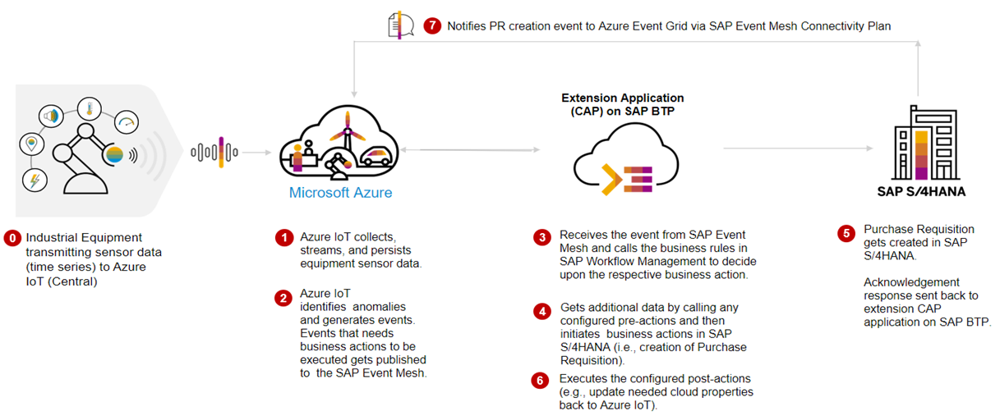
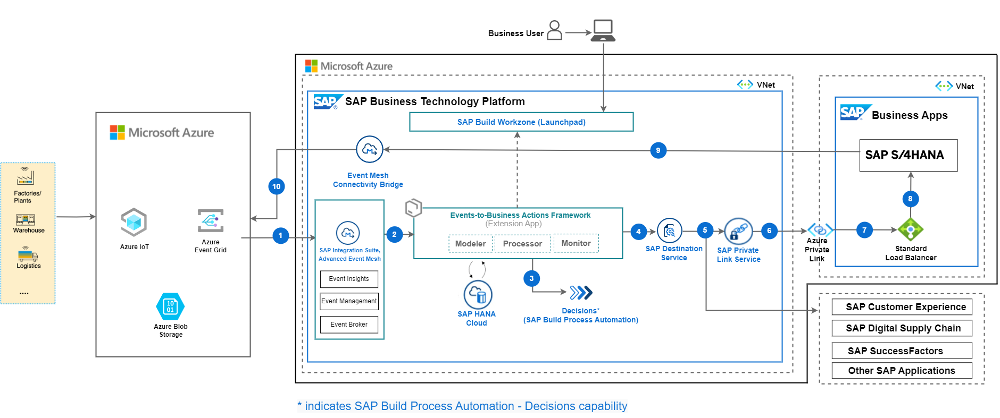
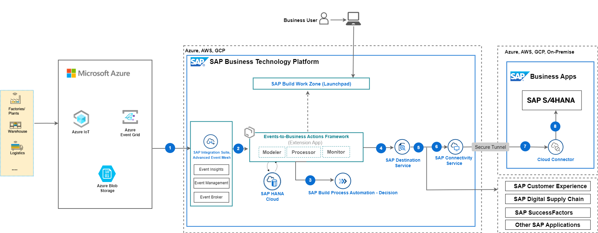

## Getting Started - Support Industry 4.0 with Event-Driven Architecture 

> **IMPORTANT**: This section is for informational purposes only and does not require any actions to be taken by the participants. Its aim is to provide a better understanding of the preconfigurations. The goal is to provide a clear understanding of the concepts and technologies involved.

### 1. Business Process Flow

In this event-driven scenario, based on the real-time status of the IoT Devices , actionable events are sent to Events-to-Business-Actions framework built on SAP BTP via SAP Integration Suite Advanced Event Mesh to decide on the critical business actions to be taken in the SAP Enteprise Business systems such as SAP S/4HANA System.

 

- Data from industrial IoT Devices are sent to Microsoft Azure IoT Central.   
- Rules in Microsoft Azure IoT identifies any event which needs attention and forwards it to SAP Integration Suite Advanced Event Mesh.   
- SAP Integration Suite, Advanced Event Mesh receives the events and triggers webhook to send the events to extension application of Events-to-Business-Actions framework running on SAP BTP.    
- Extension application of Events-To-Business-Actions framework is configured with all necessary actions to be taken.   
    - (Default Action) Calling SAP Build Process Automation - Decision capability API to determine which business action to be taken.   
    - (Main Action) execute the business action OData API call to trigger business process in ERP system.   
    - (Pre Action) call api to get master data required for business action api (Main Action).  
    - (Post Action) After business action is executed, call Microsoft Azure IoT device api to update it's status.   
   Extension application executes the business actions and any pre or post actions.

   

### 2. Hands-On Scenario

> In this hand-on session, Based on the fill level of waste container/silo a new Purchase Order Requisition is created in SAP S/4HANA.
>   -   Simulate a Waste Container device in Microsoft Azure IoT Central which constantly generates events.
>   -   Set up a rule which identifies when waste container is close to filled and forwards the event to SAP Integration Suite, Advanced Event Mesh uisng detinations in Azure IoT Central.
>   -   Advanced Event Mesh triggers the webhook to forward the event to Events-to-Business-Actions framework.
>   -   Events-to-Business-Actions-Framework will first identify that a Purchase Requisition needs to be created in SAP S/4 HANA using Decision from SAP Build Process Automation and then creates a Purchase Requisition in SAP S/4 HANA system. Once purchase requisitionn is created, it also update the Waste Container device status on Azure IoT Central.

<!-- ### 2. Solution Architecture

     

<b>Figure-1: High-level architecture (with SAP S/4HANA on Azure) </b>

  
  

<b>Figure-2: High-level architecture with SAP S/4HANA on-premise and private cloud</b>

 
 

The following steps depicts the information flow across systems (in both the scenarios)

(1) Event is triggered from Microsoft Azure IoT Central and sent to SAP Integration Suite, Advanced Event Mesh.

(2) Event-to-Business-Action framework(extension app) processor module's endpoint is subscribed to SAP Integration Suite, Advanced Event Mesh, hence receives this event.

(3) Event-to-Business-Action framework(extension app) processor module leverages the Decision capability of SAP Build Process Automation to derive business action (for example, Purchase Order Requisition creation in SAP S/4HANA system) based on certain characteristics of incoming event.

(4), (5), (6) (7) and (8) Event-to-Business-Action framework (extension app) processor module triggers the defined action in the SAP S/4HANA system by using the SAP Destination Service and SAP Private Link Service.  

In case SAP S/4HANA is on-premise and private cloud (refer to Figure-2)– communication with SAP S/4 HANA integrates via SAP Connectivity Service and Cloud Connector.

- The key services used from Microsoft Azure are the Azure IoT Central, Azure Active Directory.
- The services used from SAP BTP are the Cloud Foundry Runtime, SAP Advanced Event Mesh, SAP Build Process Automation Decisions capability, SAP Connectivity service, SAP Private Link service, SAP Workflow Management and SAP Destination service.  -->

### 3. Pre-Configured Set Up 

>- For this Hands-On scenario, we have already set up the SAP BTP Subaccount and added the Entitlements and Services required to execute this scenario. 
>- In addition, we have set up the SAP Integration Suite, Advanced Event Mesh and configured an Event Broker Service. However, as part of this hands-on, participants will set up Queue, Rest Client and Consumers etc in Advanced Event Mesh. 
>- To configure IoT devices, We have also set up a Microsft Azure IoT Central. Waste container device, rule to identify events and destination will be configured by participants as part of this hands-on.
>- We have configured the API_PURCHASEREQ_PROCESS_SRV API in our SAP S/4HANA System to create Purchase Requisitions triggered by events from Azure IoT Central. The service is activated, and a corresponding destination has been established within our SAP BTP subaccount.

### 4. **Systems and Credentials**

| Systems | Credentials |
|---------|-------------|
| **[SAP BTP Subaccount](https://emea.cockpit.btp.cloud.sap/cockpit/?idp=tdct3ched1.accounts.ondemand.com#/globalaccount/e2a835b0-3011-4c79-818a-d7767c4627cd/subaccount/0e652f06-6ee7-48d1-8877-b84274456b22)** | **Email:** IN263-XXX@education.cloud.sap   _replace XXX with the number on your laptop_ |
| **[SAP Business Application Studio](https://in263-ol7jr9xc.eu10cf.applicationstudio.cloud.sap/index.html)**| **Email:** IN263-XXX@education.cloud.sap   _replace XXX with the number on your laptop_ |
| **[SAP Integration Suite, Advanced Event Mesh](https://eu10.console.pubsub.em.services.cloud.sap/login?tenant-id=0e652f06-6ee7-48d1-8877-b84274456b22)** | **Email:** IN263-XXX@education.cloud.sap   _replace XXX with the number on your laptop_ |
| **[SAP Build Process Automation](https://in263-ol7jr9xc.eu10.build.cloud.sap/)** | **Email:** IN263-XXX@education.cloud.sap   _replace XXX with the number on your laptop_ |
| **[Microsoft Azure IoT Central](https://industry-40.azureiotcentral.com/)** | **Email:** IN263-XXX@teched2023outlook.onmicrosoft.com   _replace XXX with the number on your laptop_ |
| **[SAP S/4HANA System](https://s4hana.saptfe-demo.com:44300/sap/bc/ui5_ui5/ui2/ushell/shells/abap/FioriLaunchpad.html?sap-client=100&sap-language=EN#Shell-home)** | **Username:** S4H_PUR_DEM |

### 5. Summary

The goal of this introduction was to give a clear understanding of the concepts and techniques involved in today's hands-on scenario.

Continue to - [Exercise 1 - Build and Deploy Events-to-Business-Actions Framework on SAP BTP](../ex1/README.md)
