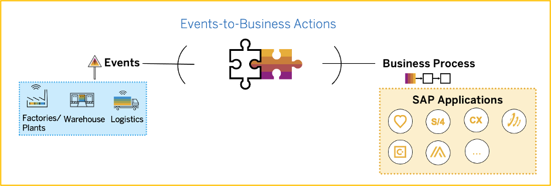
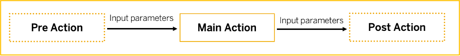
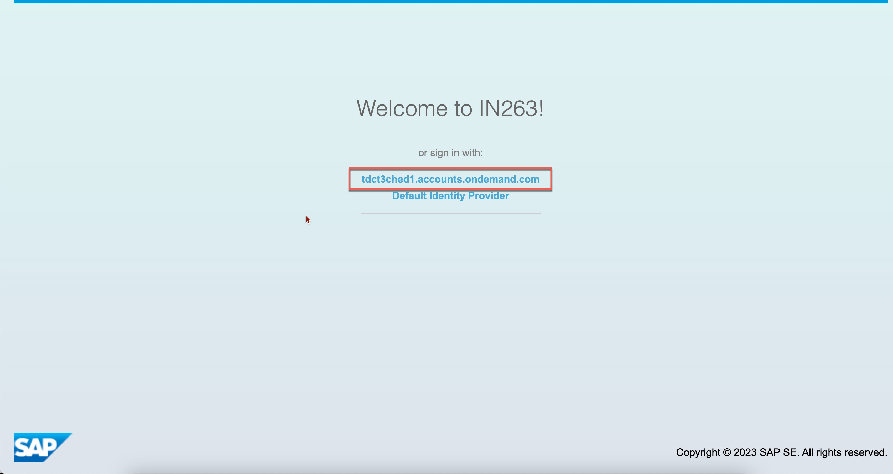
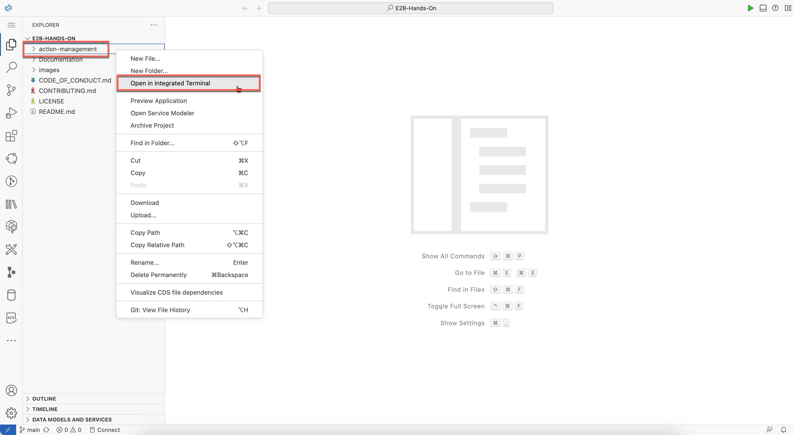

## Exercise 1 - Build and Deploy Events-to-Business-Actions Framework on SAP BTP 

In this exercise, you will clone the codebase and deploy the Events-to-Business-Actions Framework on SAP BTP using SAP Business Application Studio. You can find the SAP BTP account and SAP Business Application Studio details here: [Systems and Credentials](../ex0/README.md/#4-systems-annd-credentials)

### 1. Discover Events-to-Business-Actions Framework

>**The Events-to-Business Actions Framework implements an event-driven architecture which enables integration of SAP and non-SAP systems which can be source for events to SAP business systems like SAP S/4HANA, SAP Customer Experience or SAP Asset Performance Management etc.**

  
    
<br>

**Understanding the framework**

The framework is developed using SAP Cloud Application Programming (CAP) Model and Node.js. It has primarily 3 components.
1. **Modeler**
    - Using the Modeler UI, you can configure the business actions that need to be triggered in the Business systems (Ex: Creation of Purchase Order Requisition in SAP S/4HANA, Service Ticket in SAP Service Cloud etc.) based on the incoming event. Modeler UI is built using SAP Fiori elements and provides the following tiles to configure action types, actions, and monitor the business action execution logs.
    - “Manage action” tile can be used to configure the business actions. It is integrated with SAP Destination Service so that you can select the required destination configured for SAP business system to add the endpoint and the payload that is needed to create the business action.
    - The modeler supports defining and chaining actions based on the context flow as depicted in below figure .
        - “Default action” is used by the processor to determine which main action needs to be triggered for an incoming event. Only one default action can be defined in modeler.
        - “Main action” is the action that can be used to create a transaction in the business system (Purchase Order Requisition, Service Tickets etc.).
        - “Pre-actions” are actions that are like supporting actions that are executed before the “Main Action” so that you can use the output parameters from them while creating “Main-Action”.
        - “Post-actions” are actions that are executed after the “Main Action” is successfully executed that you can use to trigger further business processes or notify any users/systems of the Business action creation.    
          

2. **Processor**
    - Processor is the backend module that receives the from SAP Inetrgation Suite, Advanced Event Mesh topic and executes the corresponding business actions in the SAP S/4HANA system.
    - The processor executes the following steps once it receives an event:
        - Processes ‘Default Action’ to determine which business actions (Main Action) needs to be processed.
        - Fetches the respective business action definition and the associated pre/post actions.
        - Executes the defined pre-actions one by one and then executes the main business action. The processor replaces the respective dynamic values from the event/pre-actions before executing the main action.
        - Once the main action is successfully created, it executes the post-actions that are defined for this main action.

3. **Monitor**
    - Monitor application is used to monitor the status of the business actions and check the logs for troubleshooting.
    - You can drill down to the individual action execution to find out the respective logs and can be used for troubleshooting any failed execution.

For more details about the framework, you can refer the blog here: [Explore “Events-To-Business Actions” Framework](https://blogs.sap.com/2023/02/01/part-2-explore-events-to-business-actions-framework/)

### 2. Required SAP BTP Services

These are the technical prerequistics to deploy Events-to-Business-Actions Framework on SAP BTP.
- **Cloud Foundry Runtime** : Required for deploying and running the extension application in SAP BTP.
- **Authorization & Trust Management Service** : Required for securing the extension application in SAP BTP.
- **SAP Integration Suite,Advanced Event Mesh** : Required to receive events from Microsoft Azure IoT Central.
- **SAP HANA Cloud** : Backing service for the framework.
- **SAP HANA Schemas & HDI Containers** : Application database required to store action configuration and logs.
- **SAP Build Process Automation - Decisions capability** : SAP Build Process Automation - Decisions service to configure business decisions that needs to be taken based on the type of event received from Microsoft Azure IoT Central.
- **SAP Connectivity Service** : To establish connections between cloud applications and on-premise systems.
- **SAP Destination Service** : To find the destination information required to access a remote service or system from your extension application
- **SAP Private Link Service** : To establishe a private connection between selected SAP BTP services and selected services in your own IaaS provider accounts.
- **SAP Business Application Studio** : A powerful and modern development environment, tailored for efficient development of business applications for the Intelligent Enterprise.

All required services have been added to the BTP account and the details are provided here: [Systems and Credentials](../ex0/README.md/#4-systems-annd-credentials)

### 3. Deploy the Extension Application - Step by Step Solution Guide

1. Open the [SAP Business Application Studio](https://in263-ol7jr9xc.eu10cf.applicationstudio.cloud.sap/index.html). If you are getting an option to choose IDP, then choose **tdct3ched1.accounts.ondemand.com**.

      

2. Create a dev space by choosing **Create Dev Space** 

      
    <!--  -->

    Provide a name e.g. **teched_xxx** where xxx is your id from email and choose **Full Stack Cloud Application** :    

     
    <!--  -->

    Wait till the status of your space shows **running**. Then click on the space which will open the application.

    
    <!--  -->

    
3. Click on **Clone from Git** and provide url: **https://github.com/SAP-samples/teched2023-IN263.git**. 

    
    <!--  -->

    
    <!--  -->

    Then choose **open**.

    

4. Navigate to **action-management** directory. To do so, right click on **action-management** folder and choose **Open in integrated terminal**. 

     

    Your terminal will be as shown below. 

    
    <!--  -->

    Install the dependencies.
    ```cmd 
    npm install
    ```

    Build action-management application using following command:

    ```
    npm run build
    ```

5. Log in to Cloud Foundry Environment of your subaccount in SAP BTP to deploy the framework. For this follow the below step. 

    Open **Command Palette**: 

     
    <!--  -->

    Search and Choose **CF: Login to Cloud Foundry** in the prompt.

     
    <!--  -->

    This will open up the Cloud Foundry Sign In page. Choose **SSO Passcode** as authentication method. Then Click on **Open a new browser page to generate your SSO passcode** to generate your passcode. 

     
    <!--  -->

    If you are seeing **Choose Identity Provider** screen as show below, then fill **tdct3ched1-platform** as value in provider and choose **Sign in with alternative identity provider**.

     
    <!--  -->

    Copy the **SSO passcode**.

     
    <!--  -->

    Paste the passcode. and Choose **Sign in**.

     
    <!--  -->

    Once signed in successfully, Choose Org and Space as shown below. Based on authorization, you should see one org and one space only. Then Choose **Apply**

     
    <!--  -->

    Then a successfull notification will be displayed as shown below:

     
    <!--  -->

6. Deploy the application using following command in your terminal.

    ```cmd
    npm run deploy
    ```

    You should see the following logs as shown. Keep a note of the url shown in the log for action-management application.

     
    <!--  -->

    Alternatively, You can also check the status of your applications in the [SAP BTP cockpit](https://emea.cockpit.btp.cloud.sap/cockpit/?idp=tdct3ched1.accounts.ondemand.com#/globalaccount/e2a835b0-3011-4c79-818a-d7767c4627cd/subaccount/0e652f06-6ee7-48d1-8877-b84274456b22) by navigation to Space and Application. Click on **action-management** application and keep a note of the URL.

     
    <!--  -->

### 4. Congratulations!

Congratulations on completing your Exercise 1! You have successfully deployed the Events-to-Business-Actions Framework on SAP BTP.

Let's Continue to - [Exercise 2 - Configure SAP Integration Suite, Advanced Event Mesh](../ex2/README.md)