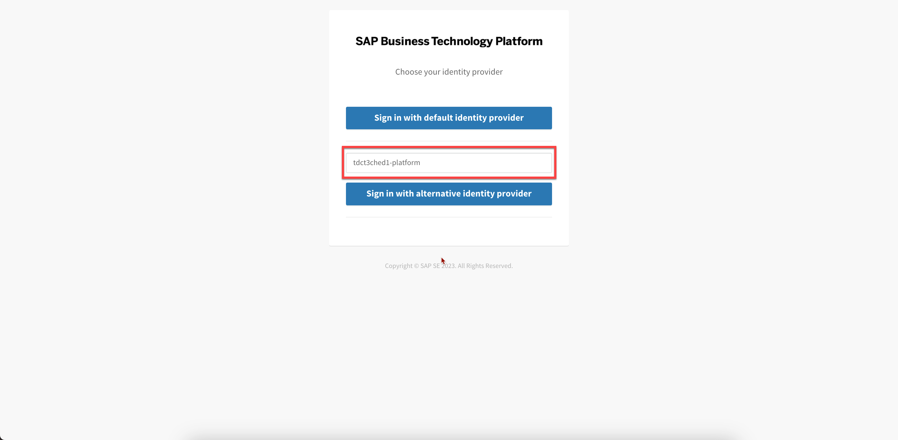

## Build and Deploy the Extension Application

In this section, you will clone the codebase and deploy the extension application in SAP BTP. 

### 1. Clone the GitHub Repository
    

Access the [Event To Action Framework](https://github.com/SAP-samples/btp-events-to-business-actions-framework) GitHub repository to download the project.

### 2. Check the Prerequisites for Deployment

Ensure you have added the required entitlements as described in section **Step1-Set-Up** page before deployment.

### 3. Deploy the Extension Application

Build and deploy the application. Run the following commands:

**Note**: Ensure you have Cloud MBT Build Tool. Refer [The Cloud MTA Build Tool (MBT)](https://help.sap.com/docs/HANA_CLOUD_DATABASE/c2b99f19e9264c4d9ae9221b22f6f589/1412120094534a23b1a894bc498c2767.html) for more details.

1. Open the SAP Business Application Studio and follow the steps below:

    

    

    

    Click on **Clone from Git** and copy the Git Clone url of this github repo and paste it.

    

    

    

    Navigate to **action-management** directory. To do so, right click on **action-management** folder and choose **Open in integrated terminal**. Your terminal will be as shown below. 

    

    Fetch the dependencies.

        ```
        npm install
        ```
    Build action-management modules.

        ```
        npm run build
        ```
    Log in to your subaccount in SAP BTP to deploy the extension application. For this follow the below step. 

    

    

    

    

    

    

    

    

    Push the application to your subaccount.

    ```
    npm run deploy
    ```

    


2. You can also check the status of your applications in the SAP BTP cockpit. Copy the value of the extension application URL.

    

3. In the SAP BTP cockpit, navigate to your subaccount and choose **Services** > **Instances and Subscriptions**. Check if you have all of the instances created post deployment as shown below. Make sure the status of all of the instances are **Created**.

    

