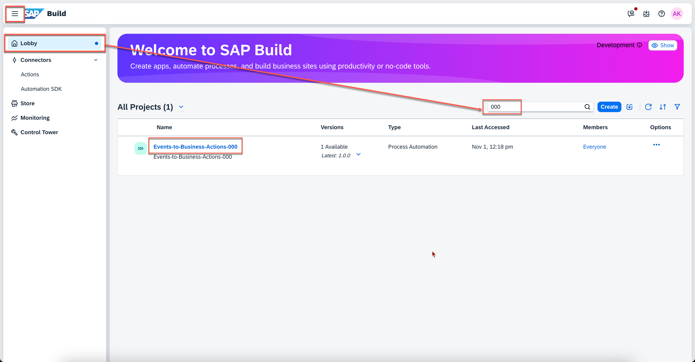
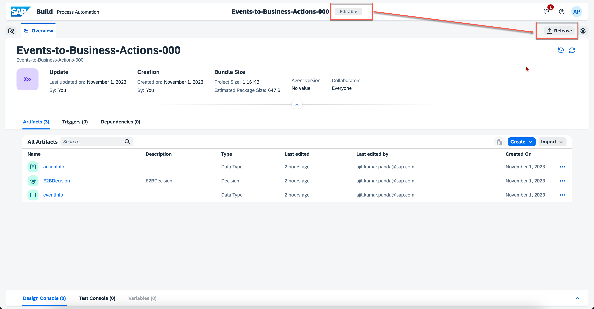
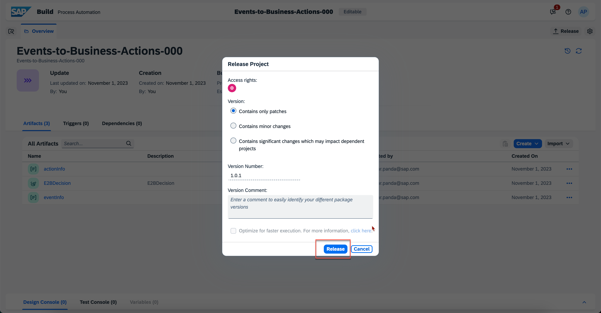
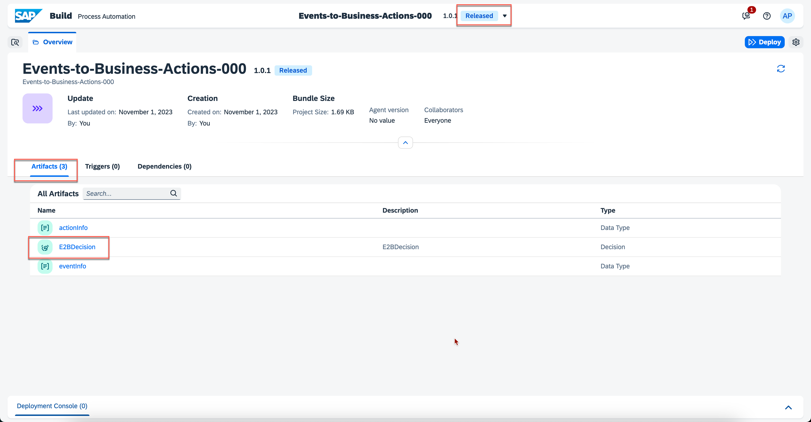
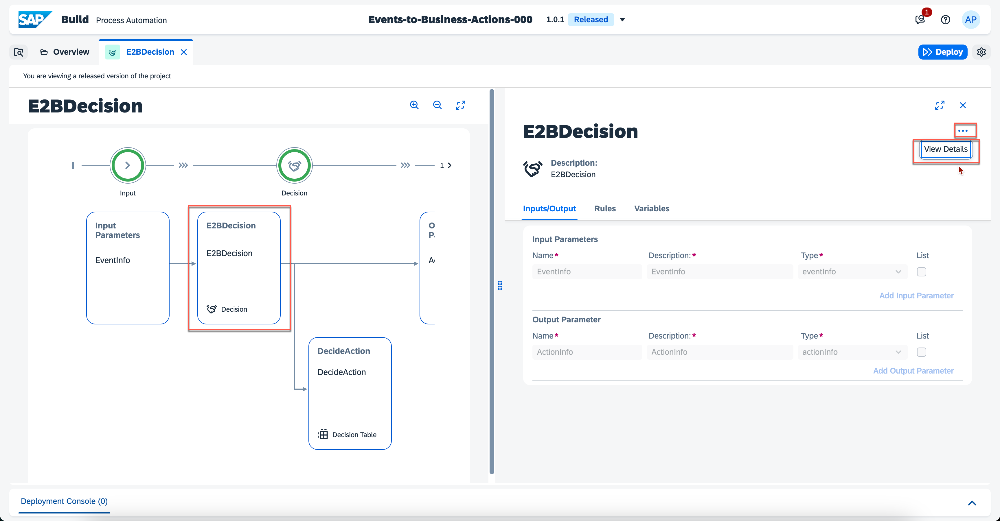
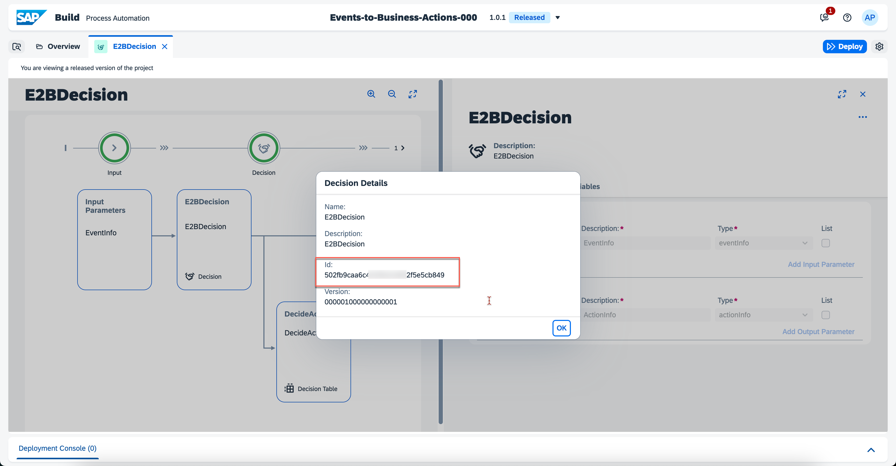

## Exercise 3 - Configure Decision in SAP Build Process Automation: Part 01

In this exercise, you will configure SAP Build Process Automation project where a Decision will be used to determine which business action should be executed for an event. You will also configure a decision table in the decision project.

### 1. Verify and Release SAP Build Process Automation Project

1. Open the [SAP Build Process Automation](https://in263-ol7jr9xc.eu10.build.cloud.sap/) Application and Login with credentials provided here:

| Systems | Credentials |
|---------|-------------|
| **[SAP Build Process Automation](https://in263-ol7jr9xc.eu10.build.cloud.sap/)** | **Email:** IN263-XXX@education.cloud.sap   _replace XXX with the number on your laptop_ |

2. We have already created a project for you. In the SAP Build Process Automation Application, Open the **Lobby** Tab , **Search** project using the number assigned to you. Click on the project Events-to-Business-Actions-xxx where xxx is the number.

    Note that, this number will also be part of your email id as well.

    
    <!--  -->

4. Once project opens, make sure you are on **Editable** version and then choose **Release**.

    
    <!--  -->

    On the pop up choose **Release** again.

    <
    <!--  -->

### 2. Verify Decision in SAP Build Process Automation Project

1. Make sure you are on **Released** version and Move to **Artifacts** tab. Then click on **E2BDecision** to open detailed information.

    
    <!--  -->

2. Click on **...** and then choose **View Details**

    
    <!--  -->

3. Copy the **Id** from the **Decision Details** and keep a note, which will be used in the Next Step.

    

### 3. Congratulations!

Congratulations on completing your Exercise 3! You have successfully configured part of SAP Build Process Automation project for Decision.

Let's Continue to - [Exercise 4 - Configure Business Actions in Events-to-Business-Actions Framework](../ex4/README.md)

