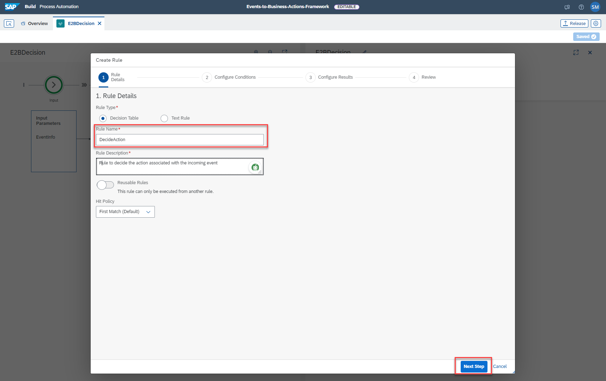
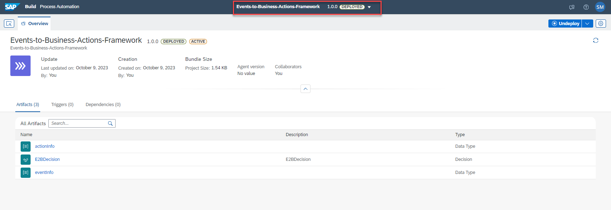

## Exercise 3 - Configure Decision in SAP Build Process Automation: Part 01

In this exercise, you will configure SAP Build Process Automation project where a Decision will be used to determine which business action should be executed for an event. You will also configure a decision table in the decision project.

### 1. Create SAP Build Process Automation Project

1. Open the [SAP Build Process Automation](https://in263-ol7jr9xc.eu10.build.cloud.sap/) Application.

2. In the SAP Build Process Automation Application, In the **Lobby** Tab , Click on **Create** button to create a new project.

    
    <!--  -->

3. Choose the **Build an Automated Process Tile**, and then choose **Business Process** Tile.

    
    <!--  -->

    
    <!--  -->

4. Fill the project name as **Events-to-Business-Actions-Framework-xxx** where XXX is the id from your email id and Choose **Create**

    
    <!--  -->

    **Accept** the disclaimer if prompted!

    
    <!--      -->

5. The Project is now created , click on **Cancel** for the **Create Process** pop-up , as we will be creating **Decisions** and it's related **Data Types** in the next steps.

    
    <!--  -->

### 2. Configure Decision in SAP Build Process Automation Project

1. Under the **Artifacts** Tab of your project, Click on **Create** and then choose **Decision** .

    
    <!--  -->

    Fill in the Decision Name as **E2BDecision** and Click on **Create**.

    
    <!--  -->

    You will see the following screeen as the decision is created successfully.

    
    <!--     -->

2. The **Decision** configuration requires the **Input and Ouput parameters** as well as the business **Rule** that maps the incoming event to it's associated business action. To configure the Input/Output parameters we need to create the Custom Data Type with the fields that the incoming event payload contains.

    Under the**Artifacts** Tab, Click on **Create** and choose **Data Types**.

    
    <!--  -->

3. We will be creating two data types namely **eventInfo** and **actionInfo** which will have the structure of the incoming event payload and the action Id respectively. To create the datatypes follow the steps shown below:

    a. Create Data Type called **eventInfo**

    
    <!--  -->

    b. Click on **New Field** and Enter the following three field details and click on **Save**. 

    | Name | Type |
    |------|------|
    | SourceSystem | String |
    | DeviceType |  String |
    | DeviceLocation | String |

    _**Note:**_ Name is case-sensitive.
       
    
    <!--  -->

    c. Under the **Artifacts** Tab, Click on **Create** and choose **Data Types**.

    
    <!--  -->

    d. Create data type called **actionInfo** 

    
    <!--  -->

    **e.** Click on **New Field** and Enter the following field details and click on **Save**. 

    | Name | Type |
    |------|------|
    | ActionId | String |

    _**Note:**_ Name is case-sensitive.

    
    <!--  -->

4. As we have now created the required data types , let us go to the **E2BDecision** and configure the Input/Output parameters.    
    - Fill the Input Paramter Name as **EventInfo** and Choose the Type from the drop down as **eventInfo**. 
    - Fill the Output Parameter Name as **ActionInfo** and choose the Type from the drop down as **actionInfo**.

    
    <!--  -->

5. Next let us configure the **Rules**. 

    a. Click on **Add Rule**

    
    <!--  -->

    b. Fill in the **Rule Name** as **DecideAction** and click on **Next Step**

    
    <!--  -->

    c. To configure the **Conditions** follow the steps shown below in sequence. 

    
    <!--  -->

    d. To configure the **Results** follow the steps shown below.

    
    <!--  -->

    e. Verify the **Review** Tab 

    
    <!--  -->

    f. An empty **Decision Table** will be created.

    
    <!--  -->

    g. Fill the fields with following values:

    >- SourceSystem: **='Azure'**,
    >- DeviceType: **='Waste Container v2**',
    >- DeviceLocation: **='Plant A'**

    ActionId to be filled later.

    
    <!--  -->

### 3. Release and Deploy SAP Build Process Automation Decision

1. To use the decision in our CAP extension application we need to deploy the Decision created. 

    First click on **Release** to release the Decisions. 
    
    
    <!--  -->

    Click on **Release**

    
    <!--  -->

2. Now that the project is released, it is ready for deployment. Click on the **Deploy**

    
    <!--  -->

    Follow the steps shown in the following screenshots.

    
    <!--  -->

    
    <!--  -->

    
    <!--  -->

3. The Project is successfully deployed ! 

    
    <!--  -->

4. Go to **E2BDecision** , Click on the three dots to **View Details** and Click on **View Details**

    
    <!--  -->

    Copy the **Id** from the **Decision Details** and keep a note, which will be used in the Next Step.

    
    <!--  -->
 

### 4. Congratulations!

Congratulations on completing your Exercise 3! You have successfully configured part of SAP Build Process Automation project for Decision.

Let's Continue to - [Exercise 4 - Configure Business Actions in Events-to-Business-Actions Framework](../ex4/README.md)

