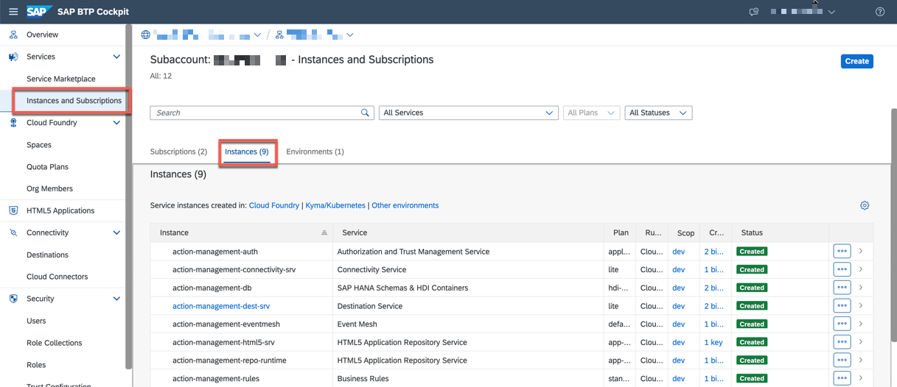
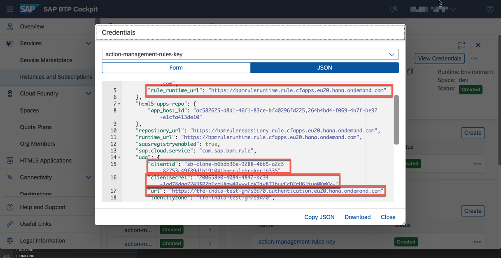
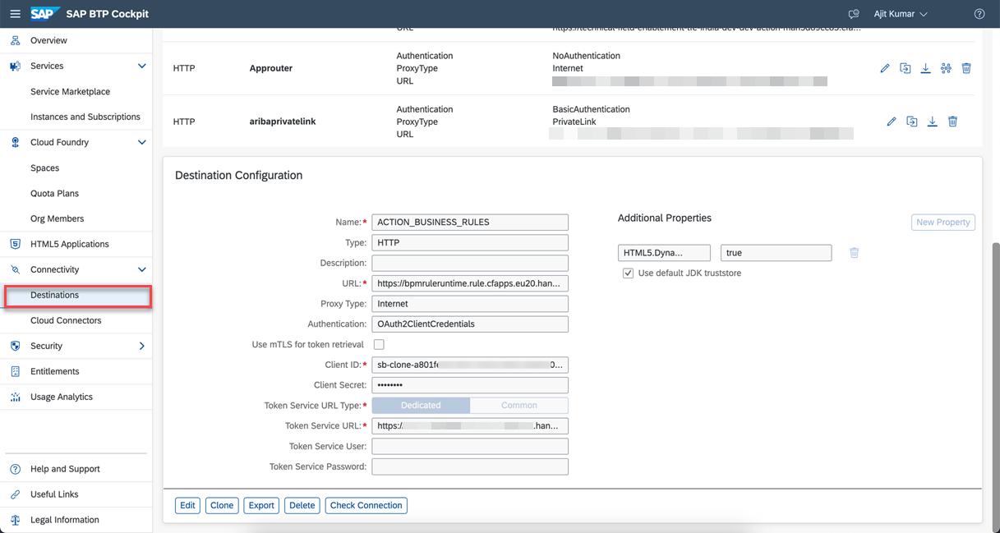
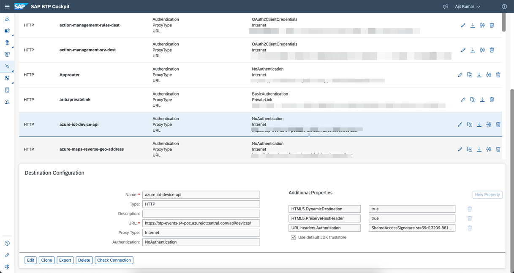
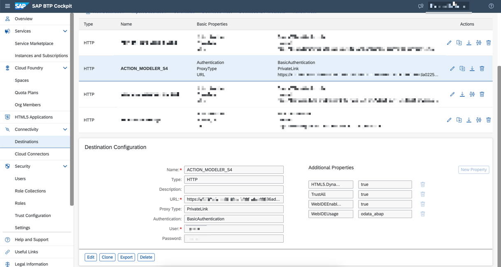

## Configure SAP S/4HANA Business Actions in the extension application

In this section, you will define business action in the action-management extension application in SAP BTP. Ensure your application's **Requested State** is **Started**.

### 1. Create Destinations

1. In the SAP BTP cockpit, navigate to your subaccount and choose **Instances and Subscriptions** and then choose **Instances**.

    

2. Choose **action-management-rules** and then choose the three dots next to **action-management-rules-key** and then choose **View** to open the service key.

    

3. Copy the values of **clientid**, **clientsecret**, **url** and **rule_runtime_url**.

    

4. In the SAP BTP cockpit, navigate to your subaccount and choose **Connectivity > Destinations**.

    

5. Create a new destination with the name **ACTION_DECISIONS** and enter the following configuration values. This is used for calling SAP Business Rules.

    - Copy the values of rule_runtime_url, clientid, clientsecret and url from Step 2 and update it for URL, Client ID, Client Secret and Token Service URL.

    ```
    Name: ACTION_DECISIONS
    Type: HTTP
    URL: <rule_runtime_url>/rules-service/rest/v2
    Proxy: Internet
    Authentication: OAuth2ClientCredentials
    Client ID: <clientid>
    Client Secret: <clientsercret>
    Token Service URL Type: Dedicated
    Token Service URL: <url>/oauth/token

    Additional Properties:
    HTML5.DynamicDestination: true
    ```

    Your destination configuration should look like this:

    

6. Create another destination with the name **azure-iot-device-api** and enter the following configuration values. This is used to call Microsoft Azure IoT Device API.

   - Copy the value of the IoT Central Application URL from IoT Central Application in Microsoft Azure Portal and append the url with /api/devices/. Update this value for URL parameter.
   - For **URL.headers.Authorization** parameter, refer [Authentication and authorization](https://learn.microsoft.com/en-us/rest/api/iotcentral/authentication) to generate API Token.

    ```
    Name: azure-iot-device-api
    Type: HTTP
    URL: <IoT Central Application URL>/api/devices/
    Proxy: Internet
    Authentication: NoAuthentication

    Additional Properties:
    HTML5.DynamicDestination: true
    HTML5.PreserveHostHeader: true
    URL.headers.Authorization: <API Token>
    ```

    Your destination configuration should look like this:

    

7. Create destination with the name **ACTION_MODELER_S4** and enter the following configuration values.

    Change host name in URL, User, Password as per your SAP S/4HANA system details.

    - In case of SAP S/4HANA system on Azure Private Cloud, choose **Proxy Type** as **PrivateLink** and the private link **hostname** copied from [Step4b-Setup-SAPPrivateLinkService](../Step4b-Setup-SAPPrivateLinkService/README.md) in the **hostname** field.

        ```
        Name: ACTION_MODELER_S4
        Type: HTTP
        URL: https://<hostname>/sap/opu/odata/sap
        Proxy Type: PrivateLink
        Authentication: BasicAuthentication
        User: <SAP S4HANA User>
        Password: <SAP S4HANA Password>

        Additional Properties:
        HTML5.DynamicDestination: true
        WebIDEEnabled: true
        WebIDEUsage: odata_abap
        TrustAll: true
        ```

        Your destination configuration should look like this:

        

    - In case of SAP S/4HANA On-Premise system, choose **Proxy Type** as **OnPremise** and use the **Virtual Host**:**Virtual Port** in the **hostname** placeholder below created at [Step4a-SetupCloudConnector](../Step4a-SetupCloudConnector/README.md) to connect using Cloud Connector.

        ```
        Name: ACTION_MODELER_S4
        Type: HTTP
        URL: https://<hostname>/sap/opu/odata/sap
        Proxy Type: OnPremise
        Authentication: BasicAuthentication
        User: <SAP S4HANA User>
        Password: <SAP S4HANA Password>

        Additional Properties:
        HTML5.DynamicDestination: true
        WebIDEEnabled: true
        WebIDEUsage: odata_abap
        ```

        Your destination configuration should look like this:

        

