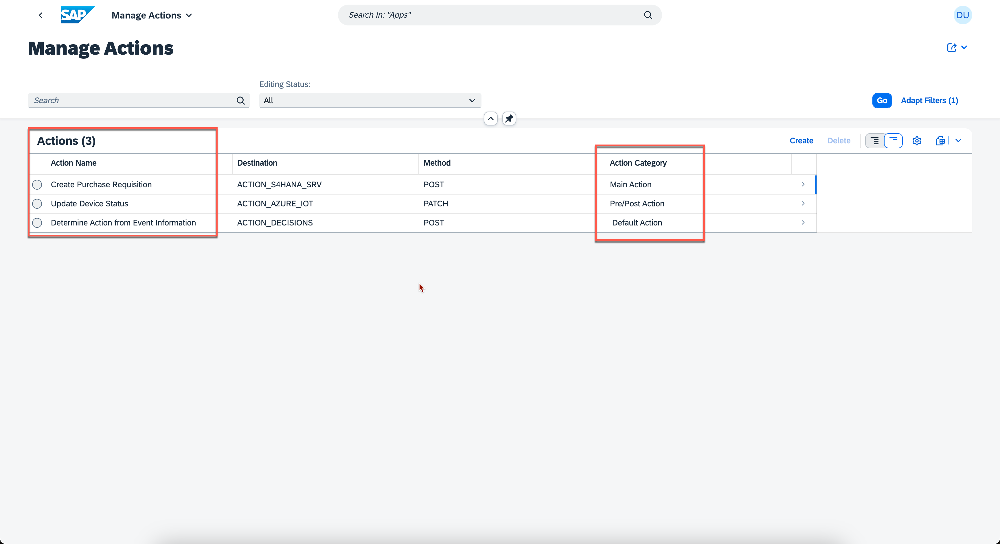

## Exercise 4 - Configure Business Actions in Events-to-Business-Actions Framework

In this exercise, you will define business action in the action-management extension application of Events-to-Business-Actions framework running on SAP BTP. 

### 1. Create Destinations

For the scope of this Hands-On , We have already set-up following destinations:
>- **ACTION_DECISIONS** : Used to call Decision Capability api of SAP Build Process Automation.
>- **ACTION_S4HANA_SRV** : Used to call APIs of SAP S/4 HANA Cloud.
>- **ACTION_AZURE_IOT** : Used to call APIs of Microsoft Azure IoT Central.

If you would like to understand, how to create destinations, step by step guide is provided here: [Create Destinations](https://github.com/SAP-samples/btp-events-to-business-actions-framework/tree/main/documentation/Integration-With-Azure-IoT/Scenario1-Inbound-to-SAPS4HANA/Step7-Configure-BusinessActions#1-create-destinations)

### 2. Configure Business Actions in  Manage Actions application

In this section, you will configure the different business actions that needs to be executed based on the event received.

1. Open [SAP BTP Subaccount](https://emea.cockpit.btp.cloud.sap/cockpit/?idp=tdct3ched1.accounts.ondemand.com#/globalaccount/e2a835b0-3011-4c79-818a-d7767c4627cd/subaccount/0e652f06-6ee7-48d1-8877-b84274456b22/subaccountoverview) and Navigate to your **Space**. 

     
    <!--  -->

    then choose **action-management** application. 
    
    
    <!--  -->
    
    Choose the url provided under **Application Routes** section. This will open up the extension application of Events-to-Business-Framework.

    
    <!--  -->

2. Choose **Manage Actions** tile.

    
    <!--  -->

<br>

3. Choose **Create** to create default action entry.

    
    <!--  -->

    create page is loaded as shown below:

    
    <!--  -->

4. In the **Basic Information** section, enter the following configuration values.

    > - Action Name: **Determine Action from Event Information**    
    > - Description: **Determine Action from Event Information**    
    > - Category: **Default Action**    

    
    <!--      -->

    Choose help on **Action Type** Input and Choose **Service Integration**

    
    <!--  -->

    Basic Information section should look like this now:

    
    <!--  -->

5. In the **HTTP Information** section, enter the following configuration values.

    **Note**: Replace **DecisionID** with the value copied from [Exercise 3 - Configure Decision in Build Process Automation: Part 01](../ex3/README.md/#3-release-and-deploy-sap-build-process-automation-decision).

    Search **Action** in Destination field and Choose **ACTION_DECISIONS**  

    
    <!--  -->

    Provide following values as shown below:

    > - Content-Type: **application/json**    
    > - Method: **POST**     
    > - Relative Path: **/v2/rule-services**    
    > - Payload: **```{ "RuleServiceId": "<DecisionID>",
                "Vocabulary": [ {   "EventInfo":{ "SourceSystem": "${{event.data.enrichments.System}}",
                                    "DeviceTemple": "${{event.data.enrichments.DeviceTemplate}}",
                                    "DeviceLocation": "${{event.data.enrichments.Location}}" }  } ] }```**    
    > - Action Id Path in Response: **Result[0].ActionInfo.ActionId**

    Your configuration should look like this:

    
    <!--  -->

6. Choose **Create**.

<br>


7. Create another business action with name **Update Device Status** and enter the following configuration values.

    **Basic Information:**
    > - Action Name: **Update Device Status**    
    > - Description: **Update Device Status**    
    > - Category: **Pre/Post Action**     
    > - Action Type: **Service Integration**      
   
    **HTTP Information:**
    > - Destination: **ACTION_AZURE_IOT**     
    > - Content-Type: **application/json**    
    > - Method: **PATCH**   
    > - Relative Path: **${{event.data.deviceId}}/properties?api-version=2022-07-31**    
    > - Payload: **```{  "Status": "Re-fill Request Created"  }```**

    Your configuration should look like this:

    
    <!--  -->

<br>


8. Create another business action with name **Create Purchase Requisition** and enter the following  configuration values.

    **Basic Information:**

    > - Action Name: **Create Purchase Requisition**    
    > - Description: **Create Purchase Requisition**    
    > - Category: **Main Action**    
    > - Action Type: **Service Integration**    
    
    **HTTP Information:**

    > - Destination: **ACTION_S4HANA_SRV**    
    > - Content-Type: **application/json**    
    > - Method: **POST**     
    > - Relative Path: **/API_PURCHASEREQ_PROCESS_SRV/A_PurchaseRequisitionHeader**     
    > - Payload:  
        <script src="https://gist.github.com/AjitKP91/a8598d7851d894403f8ba154966bae38.js"></script>
        <!-- ```
                {
                    "PurchaseRequisition": "",
                    "PurchaseRequisitionType": "NB",
                    "PurReqnDescription": "Refill Container ${{event.data.enrichments.DeviceName}}",
                    "SourceDetermination": false,
                    "PurReqnDoOnlyValidation": false,
                    "to_PurchaseReqnItem": {
                        "results": [
                            {
                            "PurchaseRequisition": "",
                            "PurchaseRequisitionItem": "10",
                            "PurchaseRequisitionType": "NB",
                            "PurchaseRequisitionItemText": "Re-fill Container",
                            "Material": "TG10",
                            "MaterialGroup": "L001",
                            "RequestedQuantity": "1",
                            "PurchasingOrganization": "1710",
                            "PurchasingGroup": "001",
                            "Plant": "1710",
                            "OrderedQuantity": "1",
                            "DeliveryDate": "2023-11-02T00:00:00"
                            }
                        ]
                    }
                }
        ```    -->
    > - Is Csrf Token Needed?: **true**     

    **Related Actions:**     
    Choose create and enter following values: 
    > - Flow Type: **Post Action**
    > - Action: **Update Device Status**

    Your configuration should look like this:

    
    <!--  -->

    Final Actions list should look like as shown below:

    
    <!--  -->

### 3. Congratulations!

Congratulations on completing your Exercise 4! You have successfully defined business action in the action-management extension application of Events-to-Business-Actions framework on SAP BTP.

Let's Continue to - [Exercise 5 - Configure Decision in Build Process Automation: Part 02](../ex5/README.md)
