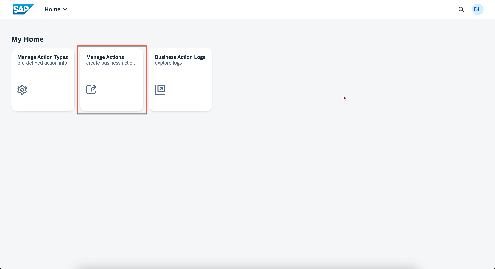
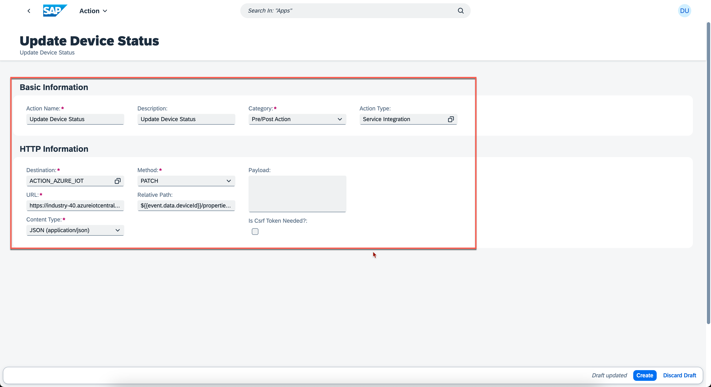

## Configure SAP S/4HANA Business Actions in the extension application

In this section, you will define business action in the action-management extension application in SAP BTP. Ensure your application's **Requested State** is **Started**.

### 1. Create Destinations

For the scope of this Hands-On , we have already set-up the destinations needed. 

To understand more about steps to configure destination in SAP BTP follow the document [Destination-Configuration](Destination-ConfigSteps.md)

### 2. Configure Business Actions in  Manage Actions application

In this section, you will configure the different business actions that needs to be executed based on the event received.

1. In the SAP BTP cockpit, navigate to your subaccount and choose **Cloud Foundry** > **Spaces**.  Choose your space and then choose **action-management** application. Choose the url provided under **Application Routes** section.

    

2. Choose **Manage Actions** tile.

    

3. Choose **Create** to create default action entry.

    

    

4. In the **Basic Information** section, enter the following configuration values.

    ```
    Action Name: Determine Action from Event Information
    Description: Determine Action from Event Information
    Category: Default Action
    Action Type: Service Integration
    ```

5. In the **HTTP Information** section, enter the following configuration values.

    **Note**: Replace **ID** with the value copied from Create SAP Build Process Automation Decision Project section of the [Step6-Configure Decisions-Part1](../Step6-Configure-BusinessRules-Part1/README.md) page.

    ```
    Destination: ACTION_DECISIONS
    Content-Type: application/json
    Method: POST
    Relative Path: /v2/rule-services
    Payload: { "RuleServiceId": "<DecisionID>",
                "Vocabulary": [ {   "EventInfo":{ "SourceSystem": "${{event.data.enrichments.System}}",
                                    "DeviceTemple": "${{event.data.enrichments.DeviceTemplate}}",
                                    "DeviceLocation": "${{event.data.enrichments.Location}}" }  } ] }
    Action Id Path in Response: Result[0].ActionInfo.ActionId
    ```

    Your configuration should look like this:

    

6. Choose **Create**.

7. Create another business action with name **Update Device Cloud Property** and enter the following configuration values.

    ```
    Basic Information:
    
    Action Name: Update Device Status With Purchase Requisition
    Description: Update Device Cloud Property
    Category: Pre/Post Action
    Action Type: Service Integration

    HTTP Information:
    Destination: azure-iot-device-api
    Content-Type: application/json
    Method: PATCH
    Relative Path: ${{event.data.deviceId}}/properties?api-version=2022-07-31
    Payload: {  "Status": "Re-fill Request Created"  }
    ```

    Your configuration should look like this:

    

8. Create another business action with name **Create Purchase Requisition** and enter the following  configuration values.

    ```
    Basic Information:

    Action Name: Create Purchase Requisition
    Description: Create Purchase Requisition
    Category: Main Action
    Action Type: Service Integration
    
    HTTP Information:
    Destination: ACTION_MODELER_S4
    Content-Type: application/json
    Method: POST
    Relative Path: /API_PURCHASEREQ_PROCESS_SRV/A_PurchaseRequisitionHeader
    Payload: {
        "PurchaseRequisition": "",
        "PurchaseRequisitionType": "NB",
        "PurReqnDescription": "Refill Silo ${{event.data.enrichments.DeviceName}}",
        "SourceDetermination": false,
        "PurReqnDoOnlyValidation": false,
        "to_PurchaseReqnItem": {
        "results": [
        {
        "PurchaseRequisition": "",
        "PurchaseRequisitionItem": "10",
        "PurchaseRequisitionType": "NB",
        "PurchaseRequisitionItemText": "Re-fill Silo",
        "Material": "TG10",
        "MaterialGroup": "L001",
        "RequestedQuantity": "1",
        "PurchasingOrganization": "1710",
        "PurchasingGroup": "001",
        "Plant": "1710",
        "OrderedQuantity": "1",
        "DeliveryDate": "2023-03-28T00:00:00"
        }
        ]
        }
        }
    Is Csrf Token Needed?: true

    Related Actions: 
    Flow Type: Post Action
    Action: Update Device Status With Purchase Requisition
    ```

    Your configuration should look like this:

    
