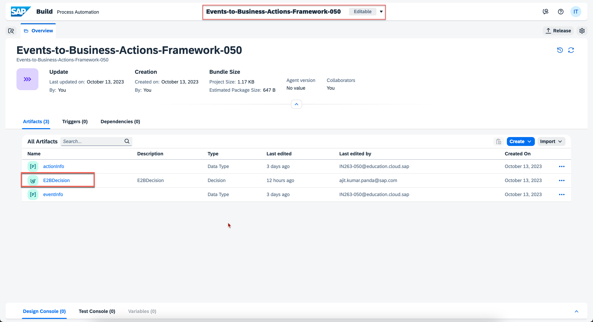
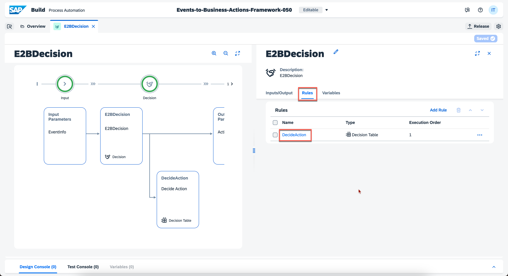
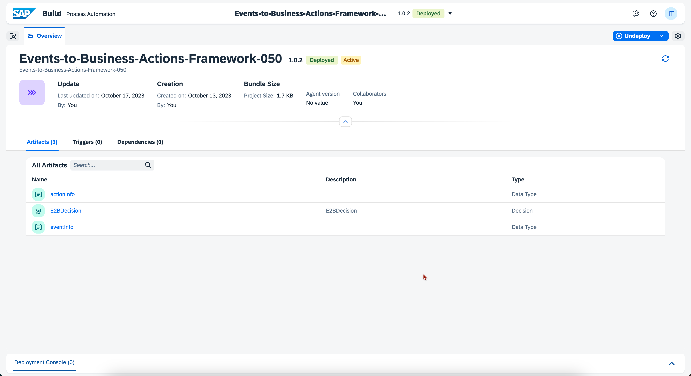

## Exercise 5 - Configure Decision in Build Process Automation: Part 02

In this exercise, you will update decision created in **Exercise 3 - Configure Decision in SAP Build Process Automation: Part 01** with action id details and activate the project.

### 1. Update Decision Table 

1. Open the [SAP Build Process Automation](https://in263-ol7jr9xc.eu10.build.cloud.sap/) Application and Login with credentials provided here:

| Systems | Credentials |
|---------|-------------|
| **[SAP Build Process Automation](https://in263-ol7jr9xc.eu10.build.cloud.sap/)** | **Email:** IN263-XXX@education.cloud.sap   _replace XXX with the number on your laptop_ |

2. In the SAP Build Process Automation Application, In the **Lobby** Tab , Click on **Events-to-Business-Actions-XXX** project.

     
    <!--  -->

3. Choose the **E2BDecision** which will open up the Decision created earlier.   
**Note:** Make sure the project is in **Editable** Mode.

     
    <!--  -->

    On the **Rules** Tab, Click the **DecideAction** Decision table.

     
    <!--  -->

4. Click on the **ActionId** Field. Paste the ActionId within singlequote which was noted in Step 9 of Part 2 in Previous Exercise [Configure Business Actions in  Manage Actions application](../ex4/README.md/#2-configure-business-actions-in-manage-actions-application)

     
    <!--  -->

    Then Choose **Save**.

5. The Decision is now configured with the required rules successfully.

    Click on **Release** to release the Decision. 
    
     
    <!--  -->

    Provide **Version Comment** of your choice and then Choose **Release**

     
    <!--  -->

6. Now that the project is released, it is ready for deployment. Click on the **Deploy**

     
    <!--  -->

    Follow the steps shown in the following screenshots.

     
    <!--  -->

     
    <!--  -->

     
    <!--  -->

7. The Project is successfully Redeployed ! 

     
    <!--  -->

### 3. Congratulations!

Congratulations on completing your Exercise 5! You have successfully updated the decision table with action id details in SAP Build Process Automation.

Let's Continue to - [Exercise 6 - Set up Device, Rule and Destination in Azure IoT Central](../ex6/README.md)

