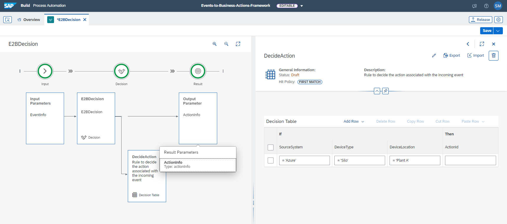
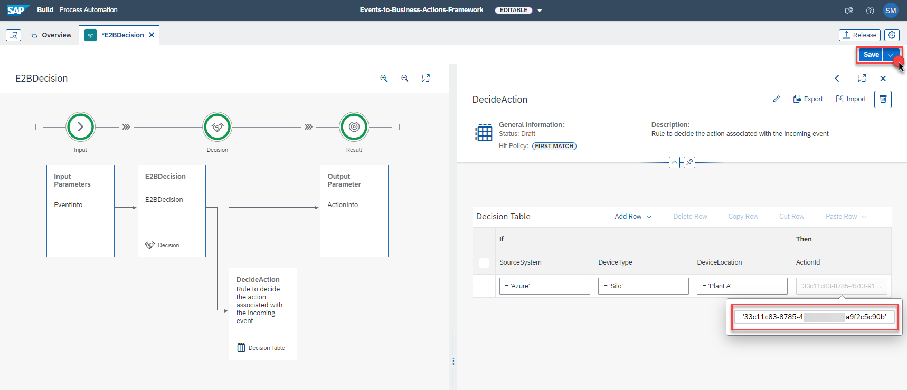
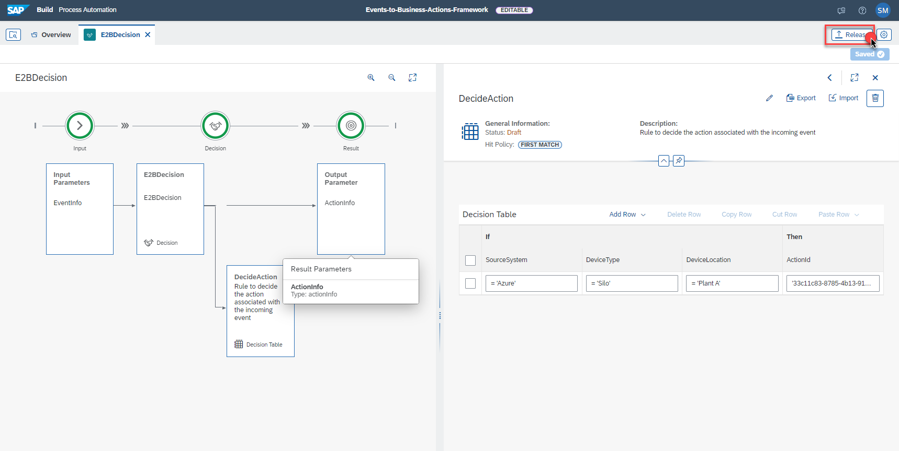
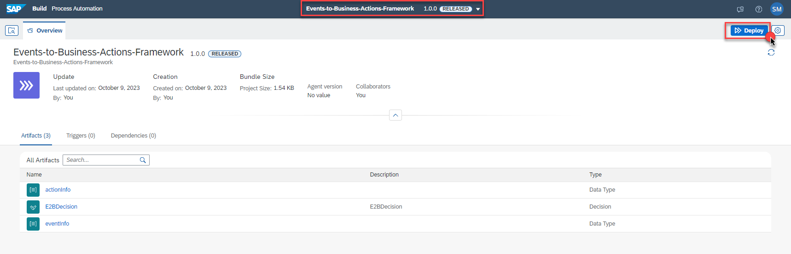
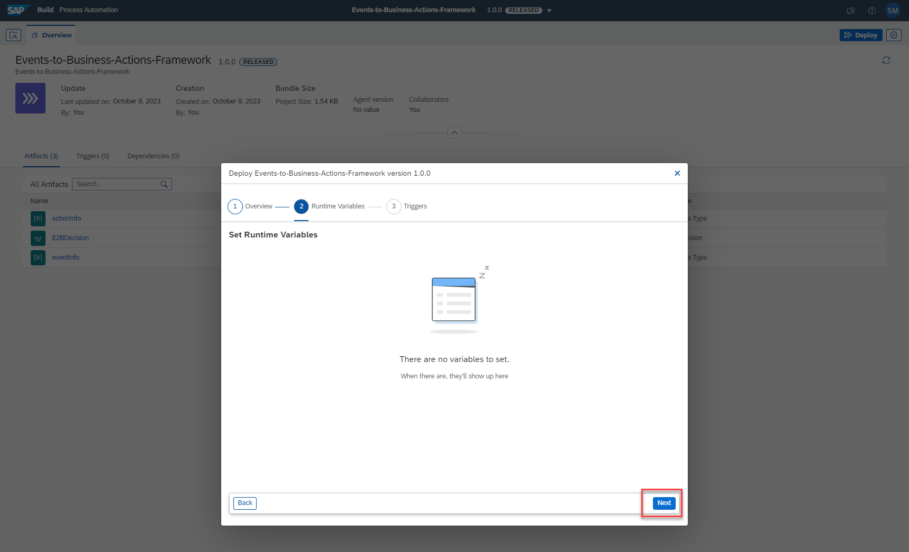

## Exercise 5 - Configure Decision in Build Process Automation: Part 02

In this exercise, you will update decision created in Exercise 3 - Configure Decision in SAP Build Process Automation: Part 01 with action id details and activate the project.

### 1. Update Decision Table 

1. In the SAP BTP Cockpit, Navigate to your subaccount -> **Sevices** -> **Instances and Subscriptions** , Open the SAP Build Process Automation Application.

    

2. In the SAP Build Process Automation Application, In the **Lobby** Tab , Click on **Events-to-Business-Actions-Framework** project.

    

3. Choose the **E2BDecision** , On the **Rules** Tab, Click the **DecideAction** Decision table.

    

4. Click on the **ActionId** Field. 

    

    Paste the ActionId of the Action Created in Step-7.  

    

5. The Decision is now configured with the Business Rule successfully. To use the decision in our CAP extension application we need to deploy all the latest changes in the Decision. 

    First click on **Release** to release the Decisions. 
    
    

    Click on **Release**

    

6. Now that the project is released, it is ready for deployment. Click on the **Deploy**

    

    Follow the steps shown in the following screenshots.

    

    

    

7. The Project is successfully Redeployed ! 

    

### 3. Congratulations!

Congratulations on completing your Exercise 5! You have successfully updated the decision table with action id details in SAP Build Process Automation.

Let's Continue to - [Exercise 6 - Set up Device, Rule and Destination in Azure IoT Central](../ex6/README.md)

