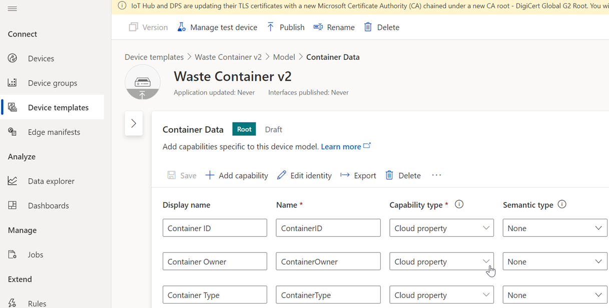
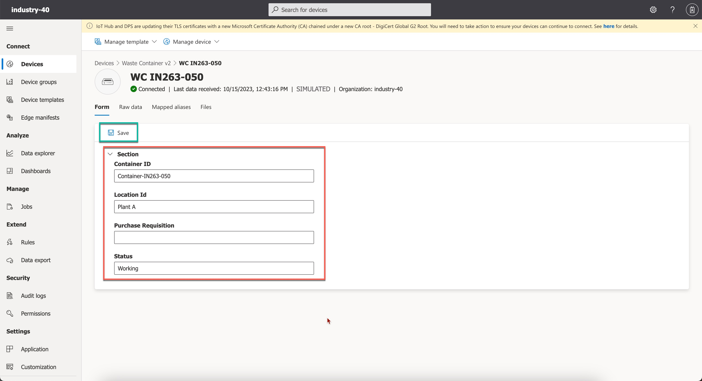

## Exercise 6 - Set up Device, Rule and Destination in Azure IoT Central    
In this exeercis, your objective is to generate a Device Template and a simulated Device that produces an event every minute. This exercise also involves setting up a Data Export with filters for your device, and sending these events to the SAP Integration Suite's Advanced Event Mesh for additional processing.

### 1. Role of Microsoft Azure IoT Central    
>
>**Azure IoT Central is a fully managed Internet of Things (IoT) platform provided by Microsoft. It simplifies the process of creating, deploying, and managing IoT solutions. Designed for businesses and organizations, IoT Central allows users to connect, monitor, and control their IoT devices securely and at scale.**     
>You can find more information about Microsft Azure IoT Central [here](https://azure.microsoft.com/en-in/products/iot-central).

### 2. Setting up Microsoft Azure IoT Central    
- We've configured a Microsoft Azure IoT Central application within our Azure subscription. You can access the application by logging in with the provided credentials here: [Systems annd Credentials](../ex0/README.md/#systems-annd-credentials)
- If you're interested in setting it up or trying it out within your own Microsoft Azure subscription, you can refer to the instructions provided on this page for detailed steps: [Set Up Microsoft Azure IoT Central](./SetUp_Azure_IoT.md)

### 3. Create a new Device Template  - "Waste Container v2"

1. Open IoT Central Application using the ceredentials provided here: [Industry 4.0 Microsoft Azure IoT Central](../ex0/README.md/#systems-annd-credentials).

    
    <!--  -->

2. In this scenario, you will create a new device template based on your custom capabilities. Open **Extend Side Navigation** and Choose **Device templates** 

    

3. Select **New** to create a new device template. 

    

4. In the **Select type** > **Create a custom device template**, select **IoT Device** to create a custom device template. Choose **Next:Customize**.

    
    <!--  -->

5. In the **Device template name** field, enter **Waste Container v2**. Choose **Next: Review**.

   
   <!--  -->

6. Review and choose **Create**. 

   
   <!--  -->

7. Choose **Import a model** to import model file.

    
    
    <!--  -->

    **Note**: **Container-Data.json** file is available in [devicetemplate](./devicetemplate/) folder. Upload this model file.

    
    <!--  -->

8. Choose **Views** and the choose **Editing device and cloud data** to add a test view.

    
    <!--  -->

9. Select the fields as per your requirement. For a sample view, you can choose **Container ID**, **Container Type**, **Location ID** and **Status** fields and choose **Save**.

    
    
    <!--  -->

10. Choose **Publish**.

    
    
    
    <!--  -->

### 4. Create a new Device of template "Waste Container v2"

11. Choose **Devices** and then choose **+ New** to create a new device. 

    
    <!--  -->

12. In the **Device Template** dropdown menu, choose the device template you created and then choose **Create**.

    
    
    <!--  -->

### 4. Configure Data Export

1. Choose **Data export** and then choose **+ New Data Export** to create new Data export.

    

2. Enter **Waste Container Export** as value. 

    In the **Type of data to export** dropdown menu, select **Telemetry** and then choose **+Message property filter**.

    

3. In the **Export the data if** dropdown menu, select **all of the conditions are true**. You can configure this as per your requirement.

4. In the **Name** field, enter **Device template** as value.

5. In the **Operator** dropdown menu, select **Equals** and in the **Value**, enter **Waste Container v2**.

    

6. Choose **+Filter**.

    

    Enter the details as shown in the below screen shot.

    

    
7. In the **Enrichments** section, choose **+Custom String** and enter the below key value pairs as shown below.

    

8. Choose **+Property** and enter the below key value pairs as shown below.

    

9. Choose **Save**.
