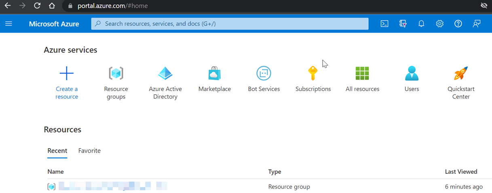
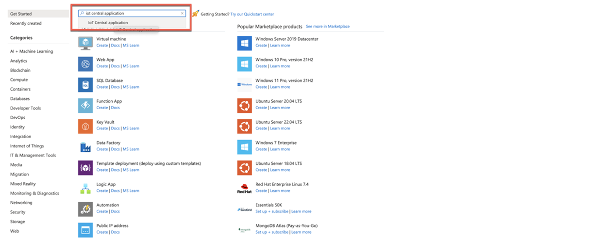
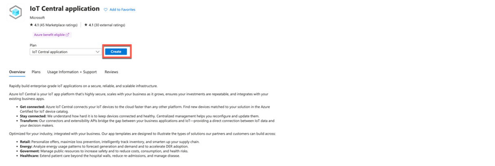
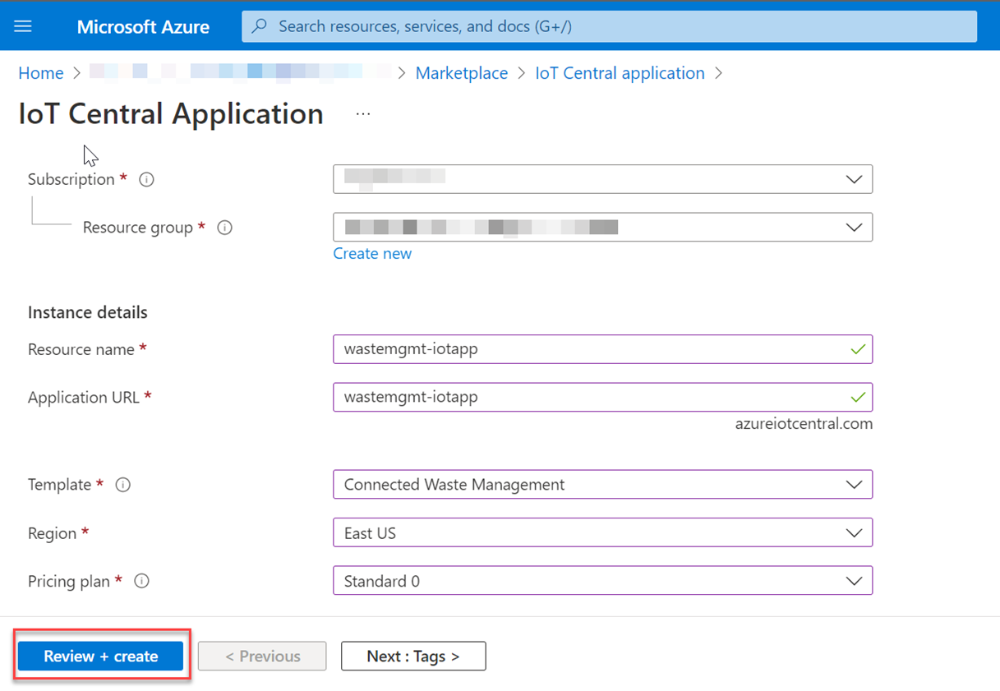

### Set Up Microsoft Azure IoT Central

>**In this tutorial, you will configure Microsoft Azure IoT Central Application. If you don't have access to a Microsoft Azure account (including a paid or trial subscription), check out the [Unit 3: Microsoft Azure basics and setup](https://open.sap.com/courses/btpma1/items/1f82kP2dhVdZ6e9xia10A8) chapter in the latest openSAP course [Building Applications on SAP BTP with Microsoft Services](https://open.sap.com/courses/btpma1/). It explains in detail how to create a new Microsoft Azure account and get a free trial subscription.**   

Once you have access to Microsoft Azure account, you will be able to see the list of Azure services in [Microsoft Azure Portal Home Page](http://portal.azure.com) .
 
 
<!--   -->

     
### Step by Step Solution Guide    

#### 1. Create Azure Resource Group

1. In the Azure portal, navigate to the **Home** page and choose **Resource groups**.
          
    <!--  -->
    
2. In the **Basics** tab, in the **Project details** section, in the **Resource group** field, enter **SAPBusinessActions**.

     
    <!--  -->

#### 2. Create Azure IoT Central application

1. In your Microsoft Azure Portal Home page, choose the created Resource Group.

2. Choose **Create**. 

     
    <!--  -->

3. From the **Marketplace** search for **IoT Central application**.

     
    <!--  -->

4. Select the **IoT Central application** tile and then choose **Create**.

     
    <!--  -->

5. In the **IoT Central application** template page,   

    - In the **Subscription** dropdown menu, select **Free Trial** in case of free trial subscription or select your subscription.
    
    - In the **Resource group**  dropdown menu, select the resource group created in Step 1.

    - In the **Resource name** field, enter  **wastemgmt-iotapp**. This is a unique name you can choose.

    - In the **Application URL** field, enter **wastemgmt-iotapp**.

    - In the **Template** dropdown menu, select **Connected Waste Management**. In this scenario, you are using the template from list of industry-relevant template to get started quickly.

    - In the **Region** dropdown menu, select your preferred location where you would like to create your application.

    - In the **Pricing plan** dropdown menu, select your preferred plan.

6. Choose **Review + create**.

     
    <!--  -->

 7. If you see a message **Validation Passed**, choose **Create**.

     
    <!--  -->

### Congratulations!

Congratulations! You have successfully created a new **"Microsoft Azure IoT Central Application"**!

Let's Continue to - [Exercise 6 - Set up Device, Rule and Destination in Azure IoT Central](../ex6/README.md/#3-create-a-new-device-template-in-iot-central-application)